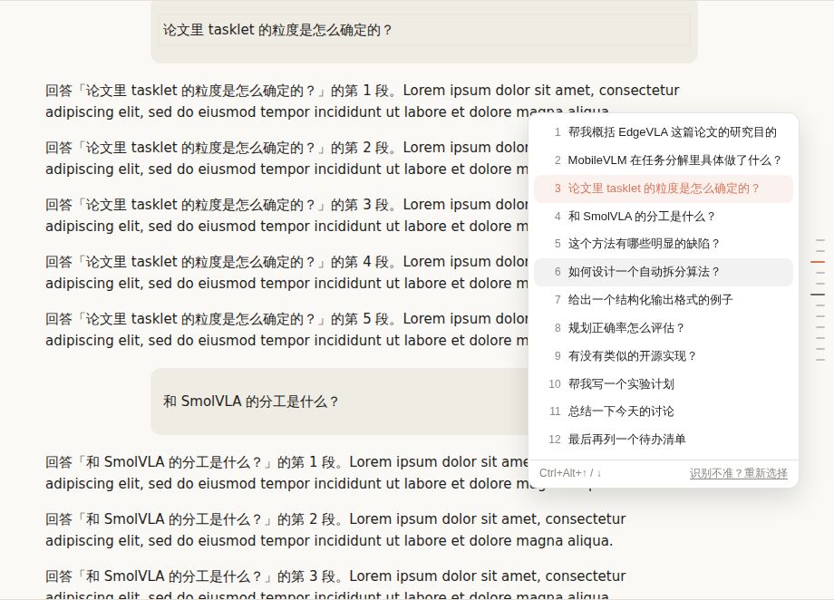

# Claude Prompt Nav

给 **Claude 桌面版**加上 ChatGPT 那样的「提问导航条」：对话左侧每条提问一个刻度，鼠标停在刻度上就能预览那条提问和回复的开头，点一下就跳回去。



- **刻度条**：一条提问一个刻度，当前读到的那条会高亮（橙色）
- **悬停预览**：鼠标所在的刻度会放大（离得越近越长、越亮），旁边弹出卡片，显示这条提问和 Claude 回复的开头；沿着刻度条上下移动，卡片跟着切换
- **点击跳转**：点刻度或卡片跳到那条提问，跳到的提问会闪一下边框
- **快捷键**：`⌃⌥↑` / `⌃⌥↓`（Windows：`Ctrl+Alt+↑/↓`）跳到上一条 / 下一条提问
- 自动跟随浅色 / 深色主题；新提问会实时出现；刷新或切换对话后自动恢复
- **识别不到时手动教它一次**：按 `⌃⌥P`，先点一条你的提问，再点一条 Claude 的回复，它会记住这个界面的结构

## 它是怎么工作的

Claude Code 插件能提供命令、skill、hook 和 MCP，但**没法改桌面版的界面**。Claude 桌面版是 Electron 应用，用 `--remote-debugging-port` 启动后可以通过 DevTools 协议往窗口里注入脚本，本项目就是这么做的：

| 文件 | 作用 |
| --- | --- |
| [`plugins/prompt-nav/prompt-nav.user.js`](plugins/prompt-nav/prompt-nav.user.js) | 导航条本体，一个无依赖的前端脚本（也可以当油猴脚本在浏览器里用） |
| [`plugins/prompt-nav/bin/claude-nav.mjs`](plugins/prompt-nav/bin/claude-nav.mjs) | 启动器 / 注入器：带调试端口启动 Claude，在后台把脚本注入每个窗口，Claude 退出后自己结束 |
| [`plugins/prompt-nav/skills/setup`](plugins/prompt-nav/skills/setup/SKILL.md) | Claude Code 命令 `/prompt-nav:setup`：一键装好启动器 |

## 安装

需要 **Node.js 22 或更新版本**：在「终端」里运行 `node --version` 查看。没有的话从 [nodejs.org](https://nodejs.org/) 下载 LTS 版安装，或者 `brew install node`。

### 方式一：终端里运行安装命令（推荐）

把下面三行粘贴到「终端」里运行：

```bash
dir=$(mktemp -d)
git clone --depth 1 https://github.com/QKWOM/Plugin.git "$dir"
node "$dir/plugins/prompt-nav/bin/claude-nav.mjs" install
```

它会把文件装到 `~/.claude-prompt-nav/`，并创建启动器。以后想**更新**，再运行一遍这三行就行。

### 方式二：作为 Claude Code 插件安装

在终端版 Claude Code（运行 `claude`）里依次运行：

```
/plugin marketplace add QKWOM/Plugin
/plugin install prompt-nav@qkwom-plugins
/prompt-nav:setup
```

`/prompt-nav:setup` 做的事和方式一相同。桌面版里如果提示 `/plugin` 不可用，用方式一。

### 之后怎么打开 Claude

- **macOS**：用 `~/Applications/Claude Prompt Nav.app` 打开 Claude（在「访达」里按 `⇧⌘H` 进入个人文件夹 → 应用程序，或者用聚焦搜索 `Claude Prompt Nav`）。它用的是 Claude 的图标，可以拖到 Dock 上替换原来的 Claude。
  如果 Claude 已经以普通方式开着，启动器会先让它退出（和按 `⌘Q` 一样），再以导航模式重新打开，所以先等正在运行的任务结束。
- **Windows**：先在右下角托盘里完全退出 Claude，再双击桌面上的 `Claude Prompt Nav.cmd`。
- 从原来的 Claude 图标打开的话不会有导航条。

也可以在终端里手动启动（Claude 退出后命令会自己结束）：

```bash
node ~/.claude-prompt-nav/bin/claude-nav.mjs start --restart
```

## 没有出现导航条？

1. 先确认 Claude 是用启动器打开的：`node ~/.claude-prompt-nav/bin/claude-nav.mjs status` 会列出每个窗口识别到几条提问。
2. 桌面版的页面结构没有公开。脚本内置了 claude.ai 使用的 `data-testid="user-message"` 等写法；如果某个界面（比如 Code 标签页）结构不同，打开一段**至少有一问一答**的对话，按 `⌃⌥P`（Windows：`Ctrl+Alt+P`），先点你的一条提问，再点 Claude 的一条回复。识别结果会保存下来，以后自动使用；识别得不对就再按一次 `⌃⌥P` 重新选。
3. 后台注入器的日志在 `~/.claude-prompt-nav/injector.log`。

在 DevTools 控制台里还可以用 `claudePromptNav.status()`、`claudePromptNav.setSelector('...')`、`claudePromptNav.resetSelector()`、`claudePromptNav.setSide('right')`（把刻度条放到右边）。

## 在浏览器里用（claude.ai）

装好 [Tampermonkey](https://www.tampermonkey.net/) 后打开
[`prompt-nav.user.js` 的 raw 链接](https://raw.githubusercontent.com/QKWOM/Plugin/HEAD/plugins/prompt-nav/prompt-nav.user.js) 即可安装，不需要启动器。

## 安全说明

调试端口只监听本机（`127.0.0.1:9333`），但在 Claude 以导航模式运行期间，**你电脑上的其他程序也能通过这个端口控制 Claude 窗口**（读取对话、操作界面）。介意的话可以不用启动器，改用手动方式：

1. 开启 Claude 的开发者工具：macOS 运行 `echo '{"allowDevTools": true}' > ~/Library/Application\ Support/Claude/developer_settings.json`（Windows 写到 `%APPDATA%\Claude\developer_settings.json`），然后重启 Claude。
2. 在 Claude 里按 `⌘⌥⇧I`（Windows：`Ctrl+Shift+Alt+I`）打开 DevTools，把 `prompt-nav.user.js` 的内容粘贴到 Console 运行（可以存成 Sources → Snippets，下次直接运行）。每次重启 Claude 后要重新运行一次。

## 卸载

```bash
node ~/.claude-prompt-nav/bin/claude-nav.mjs uninstall
```

如果是通过插件安装的，再在 Claude Code 里运行 `/plugin uninstall prompt-nav@qkwom-plugins`。

## 已知限制

- **没有在真正的 Claude 桌面版上测试过**（开发环境是 Linux 容器）。测试用 Chromium 加模拟页面覆盖了注入、自动识别、跳转、快捷键、刷新后恢复、手动选择、启动器的启动 / 重启 / 退出流程；macOS 启动器只验证了生成的文件，没有在 Mac 上运行过。
- 如果界面对长对话做了虚拟滚动（只渲染屏幕附近的消息），导航条只能列出当前已经渲染出来的提问。
- Windows 上不会自动退出正在运行的 Claude（避免误杀同名的 `claude.exe` 命令行进程），需要先手动从托盘退出。

## 开发

```bash
npm test   # 需要 Playwright 和 Chromium
```
